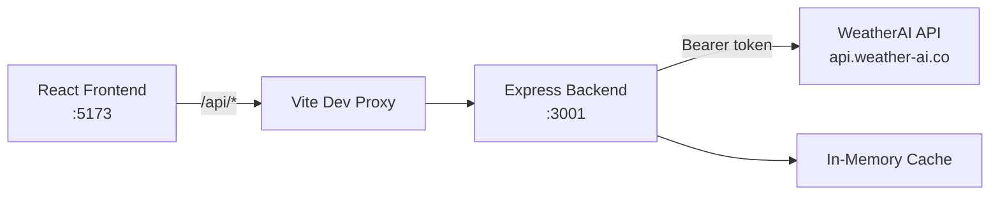

# ClimateOS

**ClimateOS** is a smart weather-and-forestry operations web application built on the [WeatherAI](https://api.weather-ai.co) free-tier API. It gives farmers and field operators a single dashboard to monitor weather, assess operational risk, run tree canopy analysis from aerial images, and stay within API quotas — all through one secure backend gateway.

**Live demo:** [weather-ai-assignment.vercel.app](https://weather-ai-assignment.vercel.app)

---

## Table of Contents

- [Overview](#overview)
- [Features](#features)
- [Tech Stack](#tech-stack)
- [Architecture](#architecture)
- [Prerequisites](#prerequisites)
- [Setup Guide](#setup-guide)
- [Environment Variables](#environment-variables)
- [Running the App](#running-the-app)
- [Production Build](#production-build)
- [Deploy to Vercel](#deploy-to-vercel)
- [Project Structure](#project-structure)
- [API Reference (Backend Gateway)](#api-reference-backend-gateway)
- [User Manual](#user-manual)
- [Quota & Performance](#quota--performance)
- [Troubleshooting](#troubleshooting)
- [Security](#security)

---

## Overview

ClimateOS follows a **backend-proxy architecture**: the React frontend never sees your WeatherAI API key. All upstream calls go through an Express server that adds caching, rate limiting, and input validation.

Core workflow:

1. **Observe** — Current weather, hourly trends, and 7-day forecasts for multiple farm locations
2. **Assess** — Rule-based rain, heat, and wind risk scoring (no paid AI insights required)
3. **Recommend** — Actionable field-work windows and operational checklists
4. **Analyze** — Upload field/drone images for tree count, canopy coverage, and health metrics
5. **Govern** — Monitor monthly API usage and tree-analysis quota

---

## Features

### Dashboard (`/`)

- Live current-weather card with CDN weather icons and WMO condition labels
- Rain / heat / wind risk summary cards with animated score meters
- 7-day forecast preview strip
- API usage and tree-analysis quota meters
- Recent tree analyses snapshot
- **Location switcher** with pill buttons and **Use my location** (GPS + IP fallback)

### Locations (`/locations`)

- Add, edit, and delete farm locations (name, lat/lon, county, crop type)
- **Use my location** to detect and add your current position
- Set a default location for the app header
- Per-location mini weather card (temperature + icon)

### Forecast Explorer (`/forecast`)

- Toggle views: **Current**, **Hourly** (temperature + rain probability charts), **7-Day**
- Location switcher and **Use my location**
- **Compare mode** — overlay a second location's forecast side-by-side
- API location badge (country, timezone, coordinates)

### Smart Recommendations (`/recommendations`)

- Rule-based intelligence (runs locally — **does not consume AI quota**)
- Location switcher and **Use my location**
- Rain, heat, and wind risk cards with explanations
- Field work windows: Early Morning / Midday / Late Afternoon ratings
- 24-hour and 7-day action checklists

### Tree Analysis (`/trees/analyze`)

- Drag-and-drop image upload (JPEG, PNG, WEBP — max 20 MB)
- Optional context: farmer ID, county, land acres, location, notes
- Full analysis display:
  - Tree count, density per acre, canopy %, confidence score
  - Health breakdown (healthy / needs care / needs replacement)
  - Species guess, observations, recommendations
  - Original vs. detection overlay images
  - CV engine debug details
- Low-confidence warning banner

### Tree History (`/trees/history`)

- Paginated list of past analyses (10 / 20 / 50)
- Trend charts: tree count, canopy %, healthy count
- Decline detection alerts vs. previous analysis

### Usage & Quota (`/usage`)

- Monthly API request and AI request meters
- Tree analysis quota (used / remaining / reset date)
- Budget estimator and optimization tips

### Settings (`/settings`)

- Temperature units (°C metric / °F imperial)
- Language preference (en, sw, fr)
- Timezone
- Refresh strategy: **Normal** (10 min) or **Saver** (30 min)
- Backend health and API key status indicator

---

## Tech Stack

### Frontend

| Technology | Purpose |
|---|---|
| **React 18** + **TypeScript** | UI framework |
| **Vite 6** | Dev server and build tool |
| **React Router 7** | Client-side routing |
| **TanStack Query** | Server state, caching, retries |
| **Zustand** | Local persistence (locations, preferences) |
| **Tailwind CSS** | Styling and design system |
| **Framer Motion** | Page and card animations |
| **Recharts** | Hourly temperature, rain, and trend charts |
| **Lucide React** | Icons |

### Backend

| Technology | Purpose |
|---|---|
| **Node.js** + **Express** | API gateway |
| **TypeScript** | Type safety |
| **node-cache** | In-memory response caching |
| **express-rate-limit** | Abuse protection (60 req/min) |
| **Multer** | Multipart upload relay for tree images |
| **dotenv** | Environment configuration |

### External API

| Service | Usage |
|---|---|
| **WeatherAI** (`api.weather-ai.co`) | Weather, trees, usage, quota |

---

## Architecture



**Data flow:**

1. User interacts with the React UI
2. Frontend calls `/api/...` (proxied to `localhost:3001` in development)
3. Backend validates input, checks cache, and proxies to WeatherAI
4. Response is normalized and returned; sensitive headers (API key) never reach the browser

---

## Prerequisites

- **Node.js** 18+ (22 recommended)
- **npm** 9+
- A **WeatherAI API key** (prefix `wai_`) — get one from the WeatherAI dashboard
- Two terminal windows (or tabs) for development — **backend and frontend run separately**

---

## Setup Guide

### 1. Clone / open the project

```bash
git clone https://github.com/Dr-AddictStein/weather-ai-assignment.git
cd weather-ai-assignment/climateos
```

### 2. Install dependencies

```bash
# From climateos/
npm run install:all
```

Or install individually:

```bash
cd climateos/backend && npm install
cd ../frontend && npm install
```

### 3. Configure the backend

```bash
cd climateos/backend
cp .env.example .env
```

Edit `climateos/backend/.env` and set your WeatherAI credentials:

```env
WEATHERAI_BASE_URL=https://api.weather-ai.co
WEATHERAI_API_KEY=wai_your_key_here
PORT=3001
CORS_ORIGIN=http://localhost:5173
```

> **Never commit `.env` or paste your API key into the frontend.**

### 4. Start both servers

**Terminal 1 — Backend (required first):**

```bash
cd climateos/backend
npm run dev
```

You should see:

```
ClimateOS backend running on http://localhost:3001
```

**Terminal 2 — Frontend:**

```bash
cd climateos/frontend
npm run dev
```

Open **http://localhost:5173** in your browser.

---

## Environment Variables

| Variable | Required | Default | Description |
|---|---|---|---|
| `WEATHERAI_BASE_URL` | Yes | `https://api.weather-ai.co` | WeatherAI API base URL |
| `WEATHERAI_API_KEY` | Yes | — | Your `wai_...` API key |
| `PORT` | No | `3001` | Backend listen port |
| `CORS_ORIGIN` | No | `http://localhost:5173` | Allowed frontend origin |

---

## Running the App

| Command | Location | Description |
|---|---|---|
| `npm run dev` | `climateos/backend/` | Start API server with hot reload |
| `npm run dev` | `climateos/frontend/` | Start Vite dev server |
| `npm run dev:backend` | `climateos/` | Shortcut for backend dev |
| `npm run dev:frontend` | `climateos/` | Shortcut for frontend dev |
| `npm run build` | `climateos/` | Build both projects for production |
| `npm start` | `climateos/backend/` | Run compiled backend (`dist/`) |
| `npm run preview` | `climateos/frontend/` | Preview production frontend build |

### Verify backend is running

```bash
curl http://localhost:3001/api/health
```

Expected response:

```json
{
  "status": "ok",
  "keyConfigured": true,
  "timestamp": "2026-06-05T12:00:00.000Z"
}
```

---

## Production Build

```bash
# From climateos/
npm run build
```

- Backend output: `climateos/backend/dist/`
- Frontend output: `climateos/frontend/dist/`

Run the backend:

```bash
cd climateos/backend
npm start
```

Serve the frontend `dist/` folder with any static host (Nginx, Vercel, etc.) and point `/api` requests to your backend URL. Update `CORS_ORIGIN` and the Vite proxy is not used in production — configure your reverse proxy instead.

---

## Deploy to Vercel

ClimateOS can be deployed as **one Vercel project** — frontend (static) and Express API (serverless) on the same domain. No separate backend host required.

### Prerequisites

- Code pushed to GitHub
- [Vercel account](https://vercel.com) (GitHub login)

### Steps

1. Go to [vercel.com/new](https://vercel.com/new) → **Import** your GitHub repo.
2. Set **Root Directory** to `climateos` (click Edit next to the repo name).
3. Framework Preset: **Other** (settings are read from `vercel.json`).
4. Add **Environment Variables**:

| Key | Value |
|---|---|
| `WEATHERAI_API_KEY` | your `wai_...` key |
| `WEATHERAI_BASE_URL` | `https://api.weather-ai.co` |

5. Click **Deploy**. Vercel builds the frontend and deploys the API at `/api/*` on the same URL.
6. Your shareable link: `https://your-project.vercel.app`

### How it works

- `vercel.json` builds `frontend/` and serves `frontend/dist`
- `api/index.ts` exports the Express app as a serverless function
- Browser calls `/api/weather` on the same origin — no `VITE_API_BASE_URL` needed
- CORS auto-includes your `*.vercel.app` URL

### Vercel limitations

| Item | Limit |
|---|---|
| Tree image upload | **4 MB max** on Vercel (platform body limit); 20 MB locally |
| In-memory cache | Resets between cold starts |
| Function timeout | 60 seconds (configured in `vercel.json`) |

---

## Project Structure

```
weather-ai-assignment/
├── README.md                # This file
└── climateos/
    ├── api/
    │   └── index.ts         # Vercel serverless entry (exports Express app)
    ├── vercel.json          # Vercel build + rewrite config
    ├── backend/
    │   └── src/
    │       ├── app.ts       # Express app (shared: local dev + Vercel)
    │       ├── index.ts     # Local dev server only
    │       ├── cache/       # In-memory TTL cache
    │       ├── config/      # Environment loader
    │       ├── middleware/  # Global error handler
    │       ├── routes/      # weather, trees, usage
    │       ├── services/
    │       │   └── weatherai/  # Upstream HTTP client
    │       └── utils/       # Validators, error mapping
    │
    └── frontend/
        └── src/
            ├── components/
            │   ├── layout/  # Sidebar, Header, AppLayout
            │   ├── trees/   # TreeAnalysisResult
            │   ├── ui/      # Cards, badges, meters
            │   └── weather/ # Charts, icons, location switcher
            ├── hooks/       # useWeather, useDetectLocation, useGeoDetect
            ├── pages/       # All 8 app pages
            ├── services/    # api.ts (frontend HTTP client)
            ├── store/       # Zustand (locations, preferences)
            ├── types/       # TypeScript interfaces
            └── utils/       # riskEngine, weatherHelpers, treeHelpers
```

---

## API Reference (Backend Gateway)

The frontend only calls these internal routes. The backend proxies to WeatherAI and injects the API key.

### Health

| Method | Route | Description |
|---|---|---|
| `GET` | `/api/health` | Backend status and key configuration check |

### Weather

All weather routes accept: `lat`, `lon`, `units` (`metric`/`imperial`), `lang`, `ai=false` (enforced), `days` (max 7 on free plan).

| Method | Route | Upstream | Cache TTL |
|---|---|---|---|
| `GET` | `/api/weather` | `/v1/weather` | 30 min |
| `GET` | `/api/current` | `/v1/current` | 10 min |
| `GET` | `/api/hourly` | `/v1/hourly` | 30 min |
| `GET` | `/api/daily` | `/v1/daily` | 30 min |
| `GET` | `/api/weather-geo` | `/v1/weather-geo` | 30 min |

> The frontend primarily uses `GET /api/weather` which returns `location`, `current`, `hourly[]`, and `daily[]` in one response.

### Trees

| Method | Route | Upstream | Description |
|---|---|---|---|
| `POST` | `/api/trees/analyze` | `/v1/trees/analyze` | Multipart image upload |
| `GET` | `/api/trees/history` | `/v1/trees/history` | Paginated past analyses |
| `GET` | `/api/trees/quota` | `/v1/trees/quota` | Remaining monthly analyses |

**Analyze form fields:** `image` (required), `farmerId`, `county`, `landAcres`, `location`, `notes`

### Account

| Method | Route | Upstream | Cache TTL |
|---|---|---|---|
| `GET` | `/api/usage` | `/v1/usage` | 3 min |

---

## User Manual

### First launch

1. Start **backend** then **frontend** (see [Running the App](#running-the-app))
2. Open http://localhost:5173
3. The app loads with a default location (Nairobi). On first visit it may auto-detect your location via IP
4. Go to **Settings** to confirm backend status shows **Connected** and **API Key Configured**

### Managing locations

1. Navigate to **Locations** in the sidebar
2. Click **Add Location** and fill in:
   - Farm name
   - Latitude & longitude
   - County / region (optional)
   - Crop type (optional)
3. Click **Set Default** on any location to make it the primary
4. Use **Edit** / **Delete** to manage existing entries

### Using "Use my location"

Available on **Dashboard**, **Forecast**, **Locations**, and **Recommendations**:

1. Click **Use my location** in the location bar (or on the Locations page header)
2. Allow browser location permission when prompted (for GPS accuracy)
3. If GPS is denied, the app falls back to IP-based detection via WeatherAI
4. A **My Location** entry is added/updated and selected automatically

### Reading the dashboard

- **Current weather card** — temperature, condition, wind, humidity (from hourly match), gusts
- **Risk cards** — scores 0–100 for rain, heat, and wind (rule-based, no AI quota used)
- **7-day strip** — daily high/low and rain probability
- **Usage meters** — track monthly API and tree analysis consumption

### Forecast explorer

1. Select a location from the pill buttons
2. Switch between **Current**, **Hourly**, and **7-Day** tabs
3. Hourly view shows temperature area chart + rain probability bar chart
4. Enable **Compare Locations** to view a second farm side-by-side

### Smart recommendations

1. Open **Smart Insights** in the sidebar
2. Select a location or use **Use my location**
3. Review risk scores and the "Why These Scores?" breakdown
4. Check **Field Work Windows** for best times to operate machinery or crews
5. Follow the **Next 24 Hours** and **Next 7 Days** action lists

### Tree analysis

1. Go to **Tree Analysis**
2. Drag an aerial/drone/field image onto the upload zone (max 20 MB)
3. Optionally fill context fields (farmer ID, county, acres, location, notes)
4. Click **Run Analysis**
5. Review metrics, health breakdown, overlay image, observations, and recommendations
6. Results appear in **Tree History** after completion

### Monitoring quota

1. Open **Usage & Quota**
2. Watch monthly request usage — switch to **Saver mode** in Settings if above 80%
3. Tree analysis quota shows remaining analyses for the billing period

---

## Quota & Performance

ClimateOS is optimized for the **WeatherAI Free plan**:

| Policy | Value |
|---|---|
| Weather `ai` parameter | Always `false` (preserves AI quota) |
| Max forecast days | 7 |
| Dashboard refresh (Normal) | Every 10 minutes |
| Dashboard refresh (Saver) | Every 30 minutes |
| Backend cache | 3–30 min depending on endpoint |
| Rate limit | 60 requests/minute per client |

**Tips to stay within limits:**

- Use **Saver mode** when not actively monitoring
- Avoid rapid manual **Refresh** clicks (5-second cooldown on the button)
- Use one `/api/weather` call per location (not separate current/hourly/daily)
- Batch tree image uploads rather than testing repeatedly

---

## Troubleshooting

### `ECONNREFUSED` / proxy errors in Vite terminal

```
[vite] http proxy error: /api/weather ...
AggregateError [ECONNREFUSED]
```

**Cause:** The frontend is running but the **backend is not** on port 3001.

**Fix:**

```bash
cd climateos/backend
npm run dev
```

Confirm with `curl http://localhost:3001/api/health`.

### `401 Unauthorized` from API calls

- Check `WEATHERAI_API_KEY` in `climateos/backend/.env`
- Restart the backend after changing `.env`
- Verify the key is active in your WeatherAI dashboard

### `429 Too Many Requests`

- Monthly or per-minute quota exceeded
- Enable **Saver mode** in Settings
- Wait for the rate-limit window or billing period reset

### Location detection fails

- Grant browser location permission, or
- The app will fall back to IP geolocation automatically
- You can always add locations manually on the **Locations** page

### Tree upload fails

- Ensure file is JPEG, PNG, or WEBP and under 20 MB (4 MB on Vercel)
- Check tree analysis quota on **Usage & Quota** (5/month on free plan)

### Port 3001 already in use

```bash
# Windows — find and stop the process using port 3001
netstat -ano | findstr :3001
taskkill /PID <pid> /F
```

Then restart the backend.

---

## Security

- WeatherAI API key is stored **only** in `climateos/backend/.env` (or Vercel env vars in production)
- The key is sent as `Authorization: Bearer wai_...` server-side only
- Frontend never receives or stores the upstream API key
- CORS is restricted to the configured frontend origin
- All user inputs (lat/lon, file type, size) are validated before proxying
- `.env` is listed in `.gitignore` — do not commit secrets

---

## WeatherAI Free Plan Scope

**Included in ClimateOS:**

- Weather: `/v1/weather`, `/v1/current`, `/v1/hourly`, `/v1/daily`, `/v1/weather-geo`
- Account: `/v1/usage`
- Trees: `/v1/trees/analyze`, `/v1/trees/history`, `/v1/trees/quota`

**Excluded (paid / out of scope):**

- `/v1/forecast14`, `/v1/insights`, `/v1/ip-lookup`
- All Webhook and SMS APIs

---

## License

This project was built as an assignment/demonstration application. WeatherAI API usage is subject to [WeatherAI's terms of service](https://api.weather-ai.co).

---

**ClimateOS** — Observe. Assess. Recommend. Analyze.
